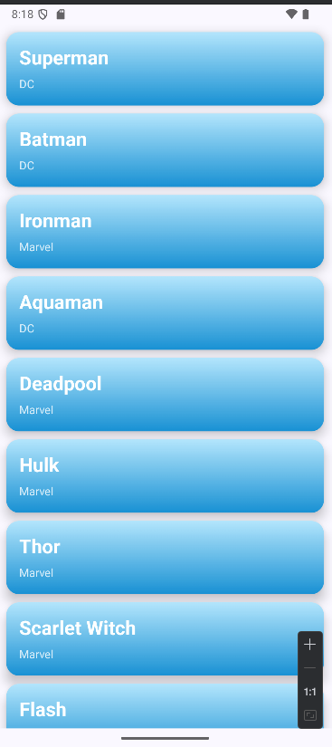
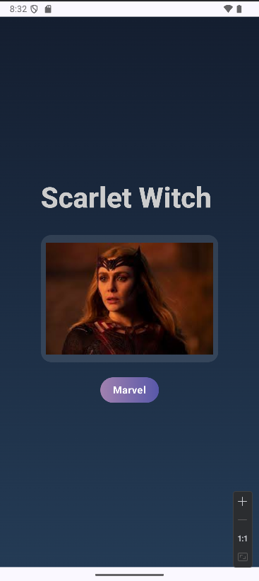
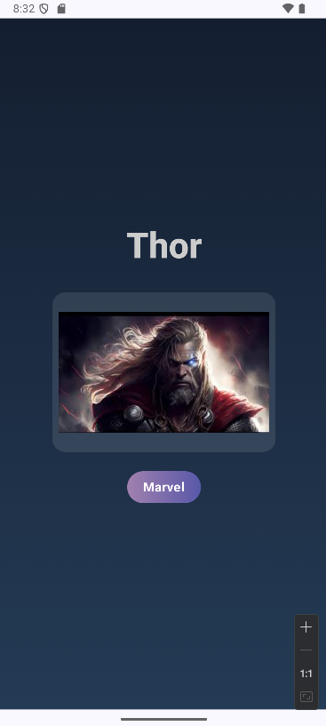

## 📱 Superhero App (Jetpack Compose & Navigation)

Bu proje, Jetpack Compose ve Navigation Compose kullanılarak geliştirilmiş basit ama görsel olarak güçlü bir süper kahraman uygulamasıdır.
Uygulamada kullanıcılar süper kahraman listesinden seçim yaparak, kahramanların detay sayfasına geçiş yapabilir.

## 🚀 Özellikler

📋 Liste ekranı: Süper kahramanların isimleri ve evrenleri (Marvel / DC).

🖼️ Detay ekranı: Kahramanın resmi, adı ve bağlı olduğu evreni.

🔄 Navigation: Liste ekranından detay ekranına yönlendirme.

🎨 Compose UI: Gradient arka planlar, kart yapıları ve modern Material3 tasarımı.

## 📑 Kahraman Listesi

  

## 🦇 Detay Ekranı

  

  

  

## 🛠️ Kullanılan Teknolojiler
-Kotlin

-Jetpack Compose

-Navigation Compose

-Material 3

-Gson

## 📂 Proje Yapısı
com.tugce.superherobook
 ┣ 📜 MainActivity.kt         #  Navigation host ve giriş noktası
 
 ┣ 📜 SuperheroList.kt        #  Liste ekranı (LazyColumn)
 
 ┣ 📜 DetailScreen.kt         #  Detay ekranı
 
 ┣ 📜 Superhero.kt            #  Model sınıfı
 
 ┣ 📂 ui/theme                #  Tema ayarları
 
 ┗ 📂 res/drawable            #  Kahraman görselleri

##  📌 Notlar

Bu proje öğrenme ve Jetpack Compose pratiği için geliştirilmiştir.

